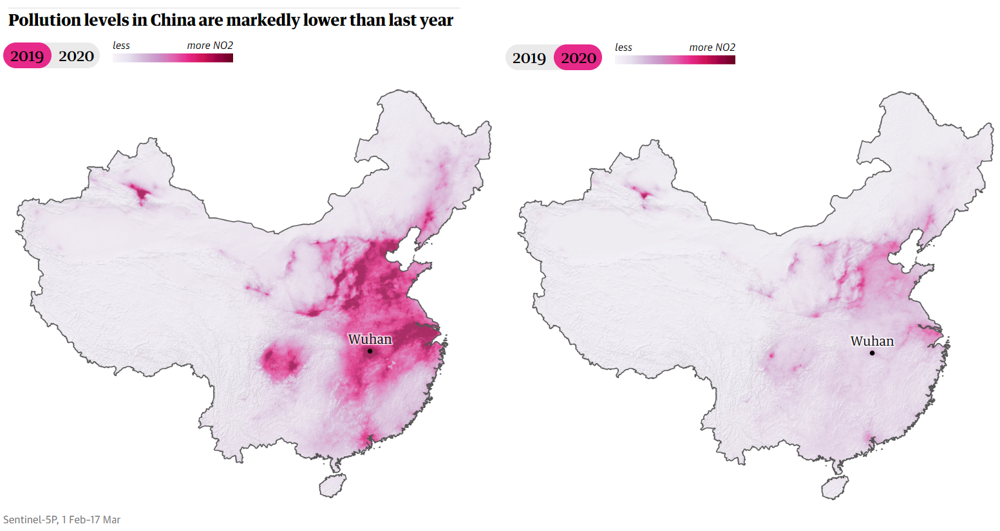

```{r setup, include=FALSE}
knitr::opts_chunk$set(echo = FALSE,
                      message = FALSE,
                      warning = FALSE,
                      fig.align = "center",
                      cache = TRUE)
```

```{r}
library(raster)
library(sf)
library(tidyverse)
library(ggspatial)
library(shadowtext)
```

(ref:guardian-caption) Graphic presented in The Guardian article ``Coronavirus pandemic leading to huge drop in air pollution'' [@Watts2020]. Nitogen dioxide raster data from the ESA Sentinel 5P satellite are presented using a gradient colour scale.

```{r fig.cap="(ref:guardian-caption)"}

```


```{r}
data_layer <- "ColumnAmountNO2CloudScreened"

# Load data and find pixel means:
files_2019 <- dir("data/omi/", "OMI-Aura_L3-OMNO2d_2019.*nc4$",
                  full.names = TRUE)
stack_2019 <- stack(files_2019, varname = data_layer) 
no2_mean_2019 <- calc(stack_2019, mean, na.rm = TRUE)

files_2020 <- dir("data/omi/", "OMI-Aura_L3-OMNO2d_2020.*nc4$",
                  full.names = TRUE)
stack_2020 <- stack(files_2020, varname = data_layer)
no2_mean_2020 <- calc(stack_2020, mean, na.rm = TRUE)
```


```{r}
# Generate an inverted mask of China.
china <- st_as_sf(maps::map("world", "china", fill = TRUE, plot = FALSE))
china_bbox <- st_as_sfc(st_bbox(china)) %>%
  st_buffer(dist = 5)
china_mask <- st_difference(china_bbox, china)
```


```{r, fig.width=8, fig.cap="Reproduction in \\texttt{ggplot2} with improvements to scale and context. Averaged nitrogen dioxide raster data from the NASA Aurora satellite are presented using the Viridis colour scale."}
# Combine the two mean rasters into a single dataframe with a year attribute.
df_2019 <- as.data.frame(no2_mean_2019, xy = TRUE) %>%
  cbind(year = 2019)
df_2020 <- as.data.frame(no2_mean_2020, xy = TRUE) %>%
  cbind(year = 2020)
df_no2 <- rbind(df_2019, df_2020)

# Hand-label some key cities for context.
city_labels <- data.frame(
  city = c("Wuhan", "Beijing", "Shanghai", "Guangzhou", "Ürümqi"),
  long = c(114.1603009, 116.1172798, 121.19657, 112.9476587, 87.4927123),
  lat = c(30.568041, 39.9385466, 31.2240453, 23.1253503, 43.8216913),
  nudge_x = c(0, 0, 4.5, 5, 0),
  nudge_y = c(1.5, 1.5, 0, -1.75, -1.25)
)

ggplot(df_no2, aes(x = x, y = y, fill = layer)) +
  geom_raster() +
  geom_sf(data = china_mask,
          fill = "white", size = 1/4,
          inherit.aes = FALSE,) +
  geom_point(aes(x = long, y = lat),
             data = city_labels,
             size = 3/4, shape = 1,
             inherit.aes = FALSE) +
  geom_shadowtext(aes(x = long + nudge_x, y = lat + nudge_y, label = city),
                  data = city_labels,
                  size = 2.5,
                  inherit.aes = FALSE) +
  facet_wrap(~year) +
  scale_x_continuous(limits = c(73.60732, 134.75233)) +
  scale_y_continuous(limits = c(18.21826, 53.55561)) +
  scale_fill_viridis_c(labels = scales::label_number(scale = 1e-16,
                                                     accuracy = 1),
                       breaks = 0:5 * 1e16) +
  guides(fill = guide_colorbar(title = expression(NO[2] ~ "molecules" 
                                                  %*% 10^16 ~ "per cm"^2),
                               title.position = "top",
                               barheight = 0.25,
                               barwidth = 7.5)) +
  coord_sf(expand = FALSE) +
  labs(title = "Pollution levels in China are markedly lower than last year",
       caption = "NASA Aura OMI instrument, 1 Feb to 17 March 2019 and 2020") +
  theme_void() +
  theme(legend.position = "top",
        legend.title = element_text(size = 8),
        legend.text = element_text(size = 6),
        legend.justification = c(0,0),
        plot.caption = element_text(size = 7, colour = "grey", hjust = 0),
        plot.caption.position = "panel",
        strip.text.x = element_text(face = "bold"))
```


# References


