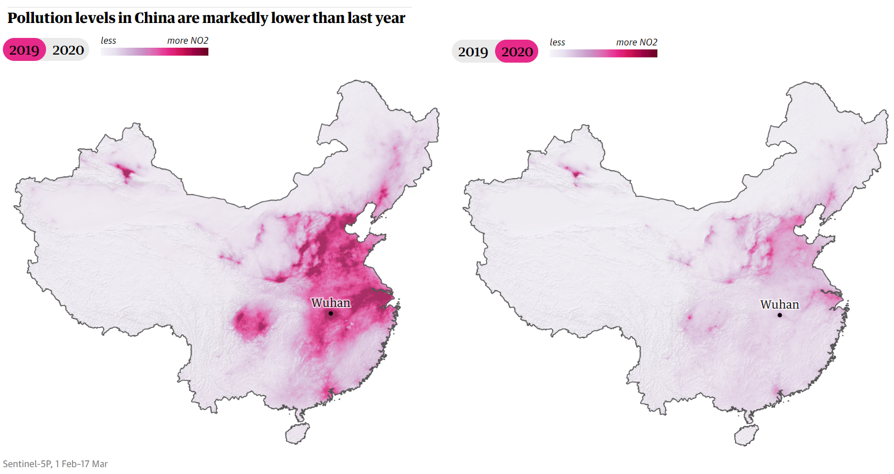

```{r setup, include=FALSE}
knitr::opts_chunk$set(echo = FALSE,
                      message = FALSE,
                      warning = FALSE,
                      fig.align = "center",
                      cache = TRUE)
```

(ref:guardian-map) Visualisation presented in The Guardian article ``Coronavirus pandemic leading to huge drop in air pollution'' [@Watts2020].

```{r guardian-chunk, fig.cap="(ref:guardian-map)"}

```

```{r, reproduction, fig.width=8, fig.cap="A reproduction in \\texttt{ggplot2} with improvements to scale and context. Zoom for detail."}
library(raster)
library(sf)
library(tidyverse)
library(ggspatial)
library(shadowtext)

# Pick the raster layer (several variables are embedded in the satellite dataset)
data_layer <- "ColumnAmountNO2CloudScreened"

# Load data and find pixel means for each year:
files_2019 <- dir("data/omi/", "OMI-Aura_L3-OMNO2d_2019.*nc4$",
                  full.names = TRUE)
stack_2019 <- stack(files_2019, varname = data_layer) 
no2_mean_2019 <- calc(stack_2019, mean, na.rm = TRUE)

files_2020 <- dir("data/omi/", "OMI-Aura_L3-OMNO2d_2020.*nc4$",
                  full.names = TRUE)
stack_2020 <- stack(files_2020, varname = data_layer)
no2_mean_2020 <- calc(stack_2020, mean, na.rm = TRUE)

# Generate an inverted mask of China to "look through" at the raster.
china <- st_as_sf(maps::map("world", "china", fill = TRUE, plot = FALSE))
china_bbox <- st_as_sfc(st_bbox(china)) %>%
  st_buffer(dist = 5)
china_mask <- st_difference(china_bbox, china)

# Combine the two mean rasters into a single dataframe with a year attribute.
df_2019 <- as.data.frame(no2_mean_2019, xy = TRUE) %>%
  cbind(year = 2019)
df_2020 <- as.data.frame(no2_mean_2020, xy = TRUE) %>%
  cbind(year = 2020)
df_no2 <- rbind(df_2019, df_2020)

# Hand-label some key cities for context.
# https://xkcd.com/2170 
city_labels <- data.frame(
  city = c("Wuhan", "Beijing", "Shanghai", "Guangzhou", "Urumqi"),
  long = c(114.1603009, 116.1172798, 121.19657, 112.9476587, 87.4927123),
  lat = c(30.568041, 39.9385466, 31.2240453, 23.1253503, 43.8216913),
  nudge_x = c(0, 0, 4.5, 5, 0),
  nudge_y = c(1.5, 1.5, 0, -1.75, -1.25))

# Build the plot:
ggplot(df_no2, aes(x = x, y = y, fill = layer)) +
  geom_raster() +
  geom_sf(data = china_mask,
          fill = "white", size = 1/4,
          inherit.aes = FALSE,) +
  geom_point(aes(x = long, y = lat),
             data = city_labels,
             size = 3/4, shape = 1,
             inherit.aes = FALSE) +
  geom_shadowtext(aes(x = long + nudge_x, y = lat + nudge_y, label = city),
                  data = city_labels,
                  size = 2.5,
                  inherit.aes = FALSE) +
  facet_wrap(~year) +
  scale_x_continuous(limits = c(73.60732, 134.75233)) +
  scale_y_continuous(limits = c(18.21826, 53.55561)) +
  scale_fill_viridis_c(labels = scales::label_number(scale = 1e-16,
                                                     accuracy = 1),
                       breaks = 0:3 * 1e16,
                       limits = c(0, 3.2e16)) +
  guides(fill = guide_colorbar(title = expression(NO[2] ~ "molecules" 
                                                  %*% 10^16 ~ "per cm"^2),
                               title.position = "top",
                               barheight = 0.25,
                               barwidth = 7.5)) +
  coord_sf(expand = FALSE) +
  labs(
    title = "Pollution levels in China are markedly lower than last year",
    caption = "NASA Aura OMI instrument, 1 Feb to 17 March 2019 and 2020") +
  theme_void() +
  theme(legend.position = "top",
        legend.title = element_text(size = 8),
        legend.text = element_text(size = 6),
        legend.justification = c(0.005,0),
        plot.caption = element_text(size = 7, colour = "grey", hjust = 0),
        plot.caption.position = "panel",
        strip.text.x = element_text(face = "bold"))
```

## *The Guardian* tells a compelling story with maps

On 23 March *The Guardian* data journalists Jonathan Watts and Niko Kommenda described a silver lining to the COVID-19 pandemic: a decrease in air pollution as a result of lock-down measures [@Watts2020]. Their piece uses a series of before-and-after visualisations of tropospheric nitrogen dioxide (NO~2~) intensity and distribution over the countries  most affected by the pandemic. The data are presented as maps, and it is their map of China (Figure \@ref(fig:guardian-chunk)) that is the subject of this critique.

The visualisation is simple, beautiful, and allows the viewer to rapidly appraise what would otherwise be complex numerical data. Latitude and longitude are mapped to the y- and x- axes of a plane. NO~2~ intensity, measured by the Copernicus Sentinel-5P satellite [@ESA2020] and averaged over a six-week period in 2019 and again in 2020, is presented as a third visual dimension on a single-hue colour scale. The change between the years is visualised by plotting the entire map twice, with the before and after states presented side-by-side. An additional dimension is encoded using relief shading to hint at China’s topography, which I will argue detracts from the effectiveness of the visualisation.

## Remote sensing visualisation is a familiar method in the mass media context

Cartography and spatial visualisation have been tools for public health for at least 150 years, pre-dating modern geographic information systems and analytical methods [@Brody2000]. The discipline of remote sensing likewise pre-dates the use of satellite sensor data: aerial photographs of cities and landscapes were taken from hot air balloons in the 19th and early 20th centuries, for purposes as diverse as urban planning to espionage [@Morain1998]. For much of the last century, the visualisation of spatial data has played a role in the analysis of air pollution [@Leighton1966], although it was not until the 1970s that the deployment of multi-spectral instruments aboard satellites allowed for the frequent measurement of pollutants over large areas, as opposed to the point data generated by ground stations [@Morain1998].

(ref:abc-caption) Image from ABC News report on the 2020 Australian bushfires [@ABC2020]. To assist the reader in determining context, the editor has added vector data for the Victorian coastline.

(ref:ozone) Image from Vox Magazine listicle of the effects of the anthropocene [@Plumer2014]. The graphic is a composite of several satellite instruments, projected onto a hemisphere and scaled with a rainbow colour map. 

```{r out.width = "50%", fig.ncol = 2, fig.cap="Use of remote sensing visualisations in mainstream journalism. Both visualisations combine spatial raster and vector data to tell a story. In both cases, vector coastlines are added to assist the viewer in establishing a context for the rest of the image. ", fig.subcap=c("(ref:abc-caption)", "(ref:ozone)")}
knitr::include_graphics(c("static/bushfire_a.jpg", "static/ozone.jpg"))
```

Remote sensing data visualisations have been presented in mass media since at least the mid 1980s, when the hole in the CFC-depleted Antarctic ozone layer was propelled into public consciousness [@Mazur1993]. Modern composite weather maps, which combine satellite radar, infra-red and visible-light data, are probably the most familiar remote sensing product for media consumers. In this context, *The Guardian* NO~2~ visualisation may be considered a form of weather map - where the atmospheric phenomenon in question is pollution. By its nature, remote sensing data journalism often explores themes of environmentalism, and *The Guardian* visualisation is no exception. With the simplicity and familiarity of a weather map, Watts and Kommenda[@Watts2020] tell a succinct but compelling story about our civilisation’s effect on the environment, and in turn nature’s unpredictable effect on civilisation.

## Elegant, but not perfect

The visualisation's effectiveness is largely due to its simplicity and the strength of the signal in the underlying data. The choices made in mapping the data to visual dimensions are not necessarily perfect, but do allow the data to tell a story without distraction.

Projecting the surface of a three-dimensional sphere onto a plane requires compromises; usually at most one or two of the spatial attributes of area, relative angle or distance can be preserved [@Lovelace2019]. Watts and Kommenda [@Watts2020] have selected a projection that does not appear to especially distort, shrink or magnify any part of China. The exact projection and whether it is area-, distance- or angle-preserving is not clear from the visualisation alone, and is not described in the text. For the purposes of this visualisation, preservation of any of these attributes is not necessary - it is unlikely that this map will ever be used for navigation. 

NO~2~ intensity is mapped to a single-hue colour scale in varying shades of magenta. The simplicity of this scale allows for rapid discrimination of the overall geographic spread of NO~2~ at both time points,  but does not allow for discrimination between close intensity values. This is a problem inherent to all single-hue scales [@Liu2018]. Colour is not truly scalar, and an enumeration of colour values as perceived by the human brain requires at least three dimensions such as luminance, hue and saturation. A colour scale is conceptually a 1D line that traverses a 3D colour space [@Kovesi2015]. Unfortunately perception of change is not linear in most colour spaces, and therefore the choice of this path significantly affects interpretability of the encoded data. This choice can reduce or heighten contrast to the point that perceptual artefacts are induced - the viewer sees differences that do not truly exist, or is unable to perceive differences that are large in the data dimension [@Borland2007]. *The Guardian* visualisation suffers from lack of contrast at several points in the colour scale. The result is that portions of the map (for example, much of the space east of Wuhan in the 2019 map) have perceptually-similar colour values despite varying by as much as a third or a quarter of the overall range of the scale. The colour scale has perceptual "flat spots".

For the inquisitive viewer, the lack of numeric labels on the colour dimension prevents quantitative comparison of NO~2~ values between regions or time points. The scale labels "less" and "more NO2" give a direction to the scale, but no sense of magnitude.  However, the choice of qualitative labels does preserve the overall simplicity of the visualisation and leaves it interpretable by the widest possible audience.

The colour scale is overloaded with a second data dimension: terrain. Hillshade is a cartographic technique that shows terrain features by simulating their 3D appearance under sunlight [@Jenny2006]. Unfortunately this requires variation in the luminance of the map - a dimension which is already occupied by the colour scale. The result is that the viewer cannot differentiate areas of darkness on the maps that are the result of NO~2~ emissions from those which are depictions of topography. Interpretation is further hampered where there is an interaction between these two effects, such as in the region north of Wuhan.

The viewer is able to establish a spatial context for the visualisation with the aid of the label for the city of Wuhan. This is topical given Wuhan's status as the possible origin of the COVID-19 pandemic (and the centre of China's lock-down), but does not allow for deeper engagement with all of the presented data. For the engaged viewer, the next cognitive step after establishing the magnitude of the change between time points is constructing a narrative to explain the data. Without pre-existing knowledge of China's geography, the reasons for the NO~2~ hotspots and plumes along the east coast are a mystery.

## Modest changes improve interrogability but diminish beauty

Figure \@ref(fig:reproduction) is a `ggplot2` reproduction of the work by Watts and Kommenda[@Watts2020]. A similar raster dataset[@Krotkov2020] was used and its values averaged over the same temporal extent.

In order to improve the interpretability of the colour scale, a perceptually-uniform colour map was chosen. The scale, Viridis, was originally computed [@Smith2015] for use in for Python's `matplotlib` but is now widely available in most graphical environments, including `ggplot2`. Viridis is an ideal choice for the representation of continuous variables, as perceived change in the scale map linearly to changes in the underlying measure[@Lovelace2019]. Some empirical evidence suggests that a carefully-designed multi-hue colour map such as Viridis can overcome the contrast limitations of single-hue scales[@Liu2018]. The colour bar legend has was augmented with numeric labels and a precise definition of what the scale represents.

The hillshade relief was removed from the reproduction. Although the hillshade enhances the appeal of Watts and Kommenda's map by giving the reader a sense of viewing real terrain, it hampered interpretation of the NO~2~ values, which are at the heart of the map's narrative. Therefore, the `ggplot2` reproduction maps only a single dimension to the colour scale.

Finally, Figure \@ref(fig:reproduction) includes the names and locations of several major cities, which serve as contextual cues for the viewer. With China's largest cities marked, the viewer can begin to form their own narrative to explain NO~2~ density over and between the cities at both time points.

These changes improve the ability of the viewer to accurately construct meaning from the dimensions encoded by the visualisation. However, despite encoding a smaller set of dimensions than the original map, the reproduction loses much of the simple elegance that makes Watts and Kommenda's visualisation so appealing.

## Appendix - R source

Full `RMarkdown` source and an `RStudio` project are available at this project's GitHub repository at https://github.com/gardiners/china-no2.

A high-resolution render of the `ggplot2` map is available at https://github.com/gardiners/china-no2/raw/master/highres.pdf.

```{r ref.label='reproduction', eval = FALSE, echo = TRUE}

```


## References